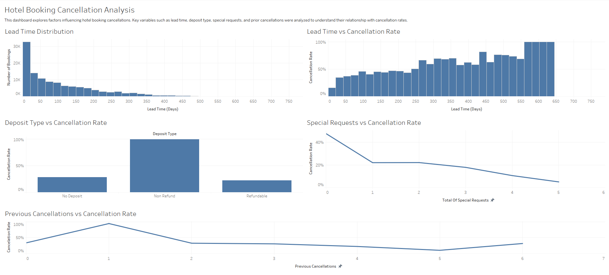

# Hotel Booking Cancellation Analysis

## Project Overview

Hotel booking cancellations create operational and revenue challenges for hotels. When reservations are canceled close to the arrival date, rooms may remain unsold and staffing or inventory planning becomes difficult.

This project analyzes hotel booking data to identify patterns associated with cancellations and builds a predictive model to estimate cancellation risk. The objective is to support data-driven decision making for revenue management, reservation policies, and operational planning.

This project demonstrates an  **analytics engineering workflow** , combining data exploration, statistical analysis, business intelligence visualization, and predictive modeling to transform raw booking data into actionable insights.

---

## Key Results

* Random Forest achieved the best performance with cross-validated **F1 score ≈ 0.53**
* **Non-refundable deposits** were the strongest predictor of cancellations
* **Lead time** significantly increased cancellation risk
* Guests with **previous cancellations** were more likely to cancel again
* Guests with **more special requests** were slightly less likely to cancel

---

## Tools & Technologies

Python

Pandas

Scikit-learn

Tableau

Excel

Jupyter Notebook

---

## Project Workflow

1. Data exploration and visualization using Tableau
2. Statistical analysis and hypothesis testing using Excel
3. Data preparation and feature engineering using Python
4. Model training and comparison across multiple algorithms
5. Hyperparameter tuning using GridSearchCV
6. Feature importance analysis
7. Translating model results into business insights and recommendations

This workflow reflects a typical  **analytics engineering process for converting raw data into decision-ready insights** .

---

## Dataset

The dataset contains hotel booking records including reservation details, customer behavior, and cancellation outcomes.

Key features analyzed:

lead_time — Number of days between booking and arrival

deposit_type — Type of deposit required for the booking

previous_cancellations — Number of cancellations by the guest in the past

total_of_special_requests — Number of special requests made by the guest

is_canceled — Whether the reservation was canceled (target variable)

---

## Exploratory Data Analysis

Exploratory analysis was conducted using Tableau and Excel to examine booking patterns and relationships with cancellation behavior.

Visualizations included:

Lead Time Distribution

Lead Time vs Cancellation Rate

Deposit Type vs Cancellation Rate

Special Requests vs Cancellation Rate

Previous Cancellations vs Cancellation Rate

The dashboard provides an overview of booking behavior and highlights patterns that influence cancellation probability.

---

## Statistical Analysis

Statistical testing was performed in Excel to evaluate relationships between selected features and cancellation outcomes.

Methods included:

Summary statistics for selected variables

Correlation analysis for numeric features

Chi-square testing for categorical variables

These tests helped identify which variables were most likely to influence cancellation behavior.

---

## Predictive Modeling

Several classification algorithms were evaluated:

Logistic Regression

Decision Tree

Random Forest

Cross-validation was used to evaluate model performance using:

Accuracy

Precision

Recall

F1 Score

ROC-AUC

Random Forest performed best overall and was selected as the final model.

Hyperparameter tuning was performed using GridSearchCV to improve model performance.

---

## Feature Importance

Feature importance analysis showed the most influential predictors were:

Non-refundable deposit type

Lead time

Previous cancellations

Total special requests

These variables provided the strongest predictive signal for identifying cancellation risk.

---

## Business Insights

Key insights from the analysis include:

Reservations with non-refundable deposits are significantly less likely to be canceled.

Bookings made far in advance tend to have higher cancellation risk due to uncertainty in travel plans.

Guests with previous cancellations demonstrate a higher likelihood of canceling future reservations.

Guests who submit more special requests appear more committed to their reservations.

---

## Business Recommendations

Encourage non-refundable deposits for reservations with long lead times.

Monitor reservations made far in advance since they carry a higher probability of cancellation.

Track repeat cancellers and consider confirmation reminders or deposit requirements.

Integrate predictive models into reservation systems to help revenue managers anticipate cancellations and optimize room availability.

---

## Repository Structure

hotel-booking-cancellation

│

├── data

│

├── excel

│   ├── hotel_univariate_statistics.xlsx

│   └── hotel_bivariate_statistics.xlsx

│

├── images

│   └── dashboard_preview.png

│

├── notebooks

│   └── hotel_cancellation.ipynb

│

├── tableau

│   └── hotel_dashboard.twbx

│

├── requirements.txt

│

└── README.md

---

## Author

Hunter Sarkis

Grand Canyon University

Aspiring Analytics Engineer
